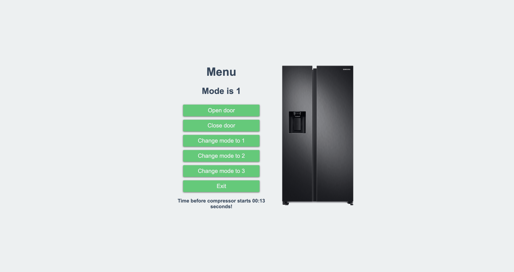
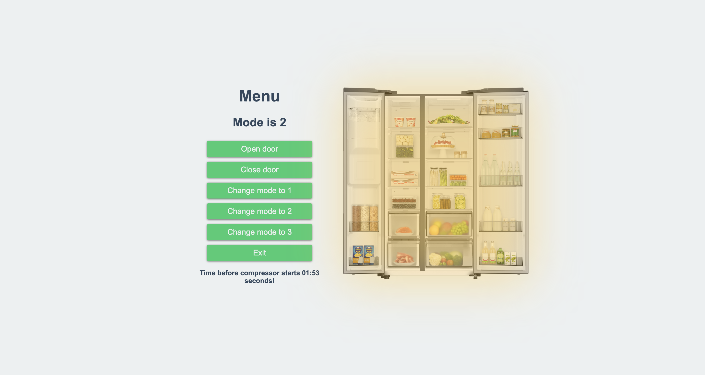

#Холодильник

##ТЗ:
Холодильник имеет переключатель режима холода 1–2–3. Внутри холодильника имеется освещение, которое включается при открытии дверцы и отключается при её закрытии. Холодильник работает по принципу: X мин компрессор работает (Х – режим холода), 1 минуту не работает (простой) и так далее по циклу. Переключатель расположен внутри холодильника, таким образом, чтобы переключить режим, необходимо открыть дверцу, при этом, после изменения режима работы счётчик времени обнуляется и запускается в новом режиме. Начальная конфигурация: холодильник закрыт, режим работы 1.

###Скриншоты работы

1. Начальные значения, где дверь закрыта и таймер по умолчанию установлен на 1 минуту.
   
2. Состояние изменено, дверь открыта, режим работы по прежнему 1.
   
3. Сменен режим работы на 2. Таймер запущен со значения: 2-х минут.
   
